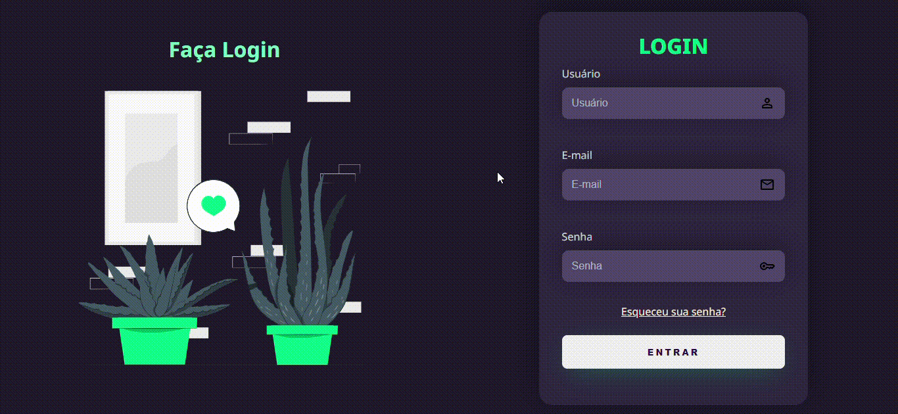
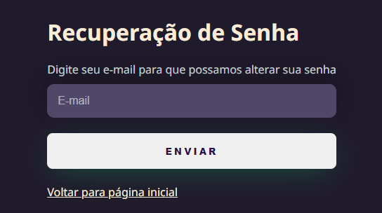

# Tela de Login - Validação com JavaScript
Este repositório contém o código para um projeto de login e recuperação de senha completo com interfaces HTML, CSS e JavaScript. O objetivo é criar um sistema de autenticação básico para um site ou aplicativo web.

## Índice
* [Descrição](#descrição)
* [Introdução](#introdução)
* [Funcionalidades](#funcionalidades)
* [Técnicas e tecnologias utilizadas](#técnicas-e-tecnologias-utilizadas)
* [Fontes Consultadas](#fontes-consultadas)

## Descrição
* Este arquivo HTML representa a estrutura básica de uma tela de login. Ele exibe uma tela de login com três campos fundamentais para o acesso a qualquer tipo de site, pedindo nome, e-mail e senha.

## Introdução
* Seja bem-vindo a tela de login! Este projeto demonstra a estrutura básica de uma tela de login em HTML e CSS, com um sistema de autenticação desenvolvido co JavaScript. 

**A estrutura do projeto:**
- ``index.html:`` Página inicial para login com formulário e ida para página de recuperação de senha.

- ``recuperacao-senha.html:`` Tela de recuperação de senha com formulário.

- ``style.css:`` Arquivo principal de estilos CSS.
- ``script.js:`` Arquivo principal de JavaScript com as função de validação.

**O que você pode fazer:**
- Adaptar o projeto de acordo com suas necessidades específicas.

## Funcionalidades
- Tela de login com campos para usuário e senha.
- Validação básica de login (verifica se os campos não estão vazios).
- Link para a página de recuperação de senha.
- Tela de recuperação de senha com campo para e-mail.
- Validação básica de e-mail (formato simples).
- Mensagens de feedback para o usuário (alertas).

## Técnicas e tecnologias utilizadas
* [<code></code>](https://developer.mozilla.org/pt-BR/docs/Web/HTML)
* [<code></code>](https://developer.mozilla.org/pt-BR/docs/Web/CSS)
* [<code></code>](https://developer.mozilla.org/pt-BR/docs/Web/JavaScript)
* [<code></code>](https://git-scm.com/)
* [<code></code>](https://bard.google.com/chat?hl=pt)
* [<code></code>](https://code.visualstudio.com/)
* [<code></code>](https://github.com/)

## Fontes consultadas 
* [Alura - Como escrever um bom README.md](https://www.alura.com.br/artigos/escrever-bom-readme)
* [Bootstrap](https://getbootstrap.com/docs/5.3/forms/checks-radios/#radios)
* [Alura - Tipos de type](https://cursos.alura.com.br/forum/topico-type-do-campo-telefone-104370)
* [Dio](https://www.dio.me/articles/tutorial-criando-um-readme-bonitao-para-o-seu-github)
* [Progamador alternativo - Youtube](https://youtu.be/HJ16WEmOWTw?si=UFvCAtBHbuCc08Hu)
* [Fotos para o subtópico "Técnicas e tecnologias consultadas"](https://github.com/alexandresanlim/Badges4-README.md-Profile)
* [Youtube - TELA DE LOGIN COM TEMA DARK | HTML + CSS](https://youtu.be/69-WfrVBli8?si=GGultNVszQg0wDUK)
* [HomeHost](https://www.homehost.com.br/blog/tutoriais/html-buttton/)
* [W3schools](https://www.w3schools.com/js/js_window_location.asp)

## Autor(a)
|  [ Ana Santos](https://github.com/AnaLu1za) |  
| :---: |

[<code></code>](https://www.linkedin.com/posts/ana-luiza-santos-a5032a2a2_projeto-acad%C3%AAmico-valida%C3%A7%C3%A3o-de-tela-de-activity-7189273725291163648-fbh6?utm_source=share&utm_medium=member_ios)
